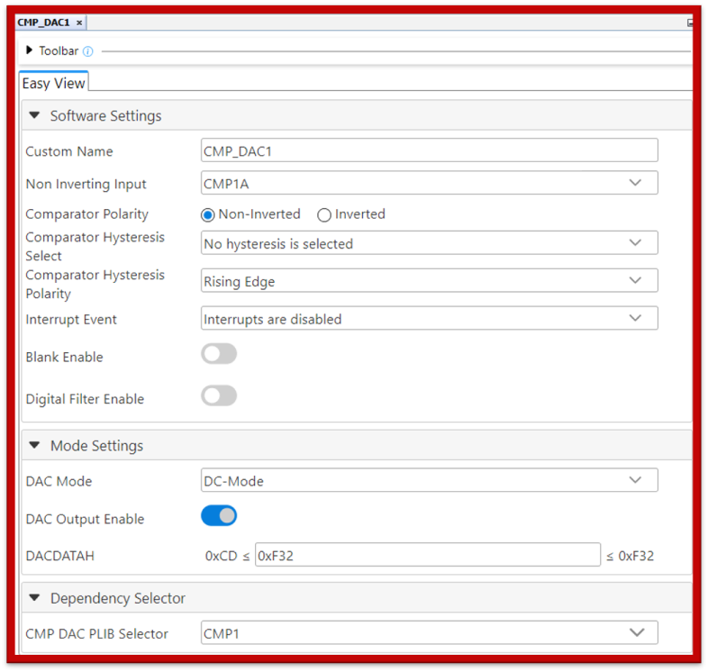
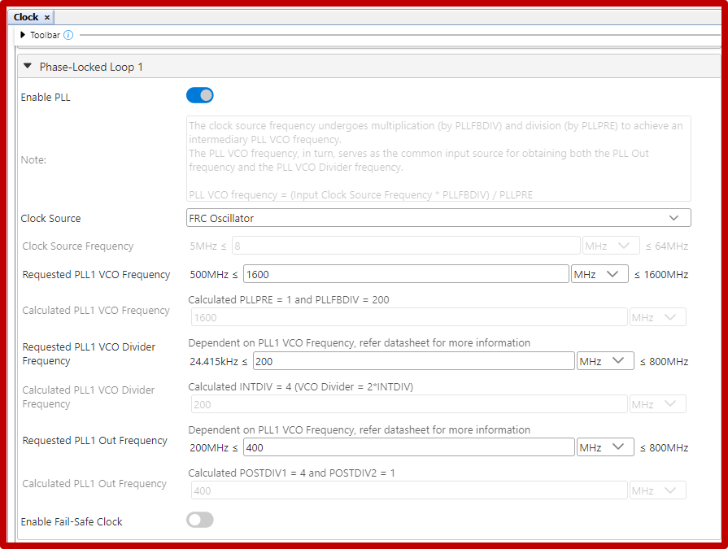
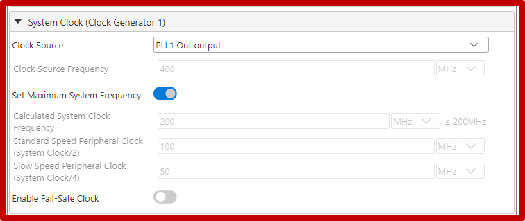
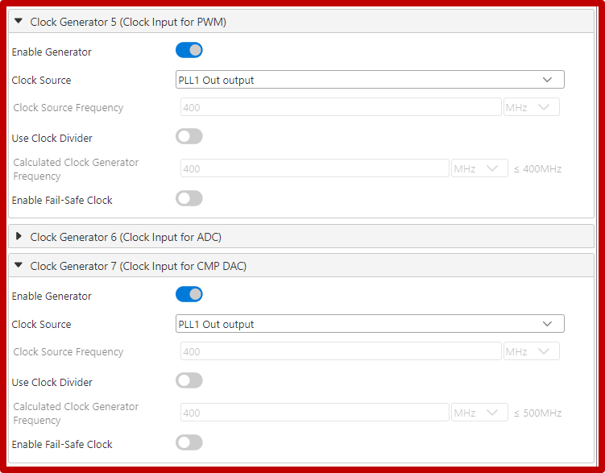

<picture>
    <source media="(prefers-color-scheme: dark)" srcset="images/microchip_logo_white_red.png">
	<source media="(prefers-color-scheme: light)" srcset="images/microchip_logo_black_red.png">
    
</picture>

## Sine Wave Demo

# Summary

This code example demonstrates how to generate a 100 Hz sine wave without CPU intervention using the DMA and DAC peripherals of the dsPIC33AK device.  

The DMA peripheral will utilize the Capture/Compare event generated by the SCCP module to iterate and place values from a 256 point sine lookup table to a DAC peripheral for output.

## Related Documentation

### DMA Driver
- [DMA Melody Driver Documentation](https://onlinedocs.microchip.com/v2/keyword-lookup?keyword=DMA_33A_MELODY_DRIVER&version=latest&redirect=true)

### DAC Driver
- [DAC Melody Driver Documentation](https://onlinedocs.microchip.com/v2/keyword-lookup?keyword=CMP_DAC_33A_Melody_Driver&version=latest&redirect=true)

### PWM Driver (For running the SCCP module in capture/compare mode)
- [PWM Melody Driver Documentation](https://onlinedocs.microchip.com/v2/keyword-lookup?keyword=PWM_33A_MELODY_DRIVER&version=latest&redirect=true)

# Software Used 
- MPLAB® X IDE  **6.20** or newer (https://www.microchip.com/MPLABXIDE)
- MPLAB® XC-DSC Compiler **3.10** or a newer compiler (https://www.microchip.com/xcdsc) 
- MPLAB® Code Configurator (MCC) **5.7.1** or newer (https://www.microchip.com/mcc)
- MPLAB® Code Configurator (MCC) Melody **2.7.1** or newer (https://www.microchip.com/melody)

# Hardware Used
- Debugging tool: PKOB (PICkit On-Board) **or** MPLAB® PICkit™ 4 In-Circuit Debugger (https://www.microchip.com/PICkit4) 
- Oscilloscope or probe to view the sine wave output.
- dsPIC33A Curiosity Platform Development Board (https://www.microchip.com/EV74H48A)
    - dsPIC33AK128MC106 General Purpose Dual In-Line Module (DIM) (https://www.microchip.com/EV02G02A)

# Setup

The sine wave demo uses the dsPIC33A Curiosity Platform Development Board.  The board is plugged in for programming through PKOB(PICkit On-Board) or the PicKit 4. 

- dsPIC33A Curiosity Platform Development Board
    - dsPIC33AK128MC106 General Purpose Dual In-Line Module (DIM)
    - The Sine Wave signal (DACOUT) can be read in on P51

## Software Setup

### Peripheral Configurations
Omitted configurations are default values set by MCC Melody. 

#### 1. DMA Melody Driver's DMA Channel 0 Settings:

|Setting|Value|Explanation|
|---|----|---|
|Enable Channel|False| Starts with channel disabled since it needs to be enabled after SCCP1 in PWM mode is initialized in the main.c.|
|Enable Reload|True|The registers are reloaded to previous values at the next start.|
|Transfer Mode|Repeated One-Shot|This allows the DMA to iterate and transfer data one value per event until it reaches the transfer count.|
|Trigger Sources|SCCP1 Timer/OC/IC Event|This checks for an of the SCCP1 capture/compare event. (Triggered by running SCCP1 in PWM mode) |
|Source Address Mode|Incremented|Increments the Source Address value by the Data Size|
|Source Address|0|This is set within the application code to use the address of the first sine wave point.|
|Destination Address Mode|Unchanged|This means the destination address will not be affected by the DMA iteration.|
|Destination Address|0|This is set within the application code.|
|Data Size|32 bit|Sets that transaction size.|
|Transfer Count|0x100|The number of times to iterate in one-shot. (256 points)|
|Interrupt Driven|True|Enables the DMA to be interrupt driven.|

#### 2. DAC Melody Driver

|Setting|Value|Explanation|
|---|---|---|
|DAC output Enable|True|This enables the DACOUT pin.|

#### 3. PWM Melody Driver
- The SCCP1 module is being used in PWM mode to generate an capture/compare event. No pin will be configured as output.

|Setting|Value|Explanation|
|---|---|---|
|Module Enable|True|Enables the PWM module.|
|Requested Frequency (Hz)|25600|This value is calculated based on the number of points to iterate multiplied by the expected output frequency. *Continued explanation in the "PWM Melody driver's requested frequency explanation" below.|
|Sync/Trigger|Sync|This is set since PWM is not triggered by any external interrupt.|
|Interrupt Driven|Disabled|This is disabled so the ISR does not impact the DMA functionality.|
|PWM PLIB Selector|SCCP1|This generates a capture/compare event being used by the DMA driver.|

#### 3. Clock Settings
- The Clock settings are configured to the highest possible speed to allow the PWM to work at higher speeds.

##### 3.1 Phase-Locked Loop 1
|Setting|Value|Explanation|
|---|---|---|
|Phase-Locked Loop 1|Enabled| This enables PLL which is required to run the PWM and |
|Clock Source|FRC Oscillator|FRC is the hardware clock|
|Requested PLL1 VCO Frequency|1600MHz  (or Maximum value)| The Requested Frequency is set to the maximum value for the peripheral clocks to use.|

##### 3.2 System Clock
|Setting|Value|Explanation|
|---|---|---|
|System Clock Source|PLL1 Out output|The PLL output (with FRC Oscillator) is required to set the maximum frequency for the system.|
|Set Maximum System Frequency to Maximum|Enabled| This enables the maximum frequency.|

##### 3.3 PWM and DAC clock input settings
|Setting|Value|Explanation|
|---|---|---|
|System Clock Source|PLL1 Out output|The PLL output (with FRC Oscillator) is required to set the maximum frequency for the peripheral.|
|Set Maximum System Frequency to Maximum|Enabled| This enables the maximum frequency.|

### Programming the Device
1. Open the dspic33ak_dac_dma_sinewave.X project in MPLAB® X IDE.
2. Right click the project in "Projects" tab of MPLAB® X IDE and select "Set as Main Project".
3. Plug in the PKOB (PICkit On-Board) or the PICkit 4 from the board to the PC.
4. Program the device by selecting the "Make and Program Device (Project dspic33ak_dac_dma_sinewave)" button on the menu bar.
5. The project should build and program successfully.

# Operation
After programming the device the output can be read off of P51 on the dsPIC33A Curiosity Platform Development Board:

A 100 Hz sine wave will be present:

## PWM Melody driver's requested frequency explanation

The PWM Melody driver (not hardware peripheral) is being used to trigger the SCCP1 Output Compare event only.

With the DMA module configured to use the "SCCP1 Timer/OC/IC Event", only the Output Compare/Input Capture event will trigger the DMA to run not the Timer callback event as the description may imply. *The selections description may be updated for newer versions of the DMA driver.

The SCCP1 capture/compare event (being used as the DMA trigger to update the DAC value) occurs on every falling edge of the PWM. The frequency we select in the PWM driver in Hz represents the number of SCCP1 events per second. Since the sine lookup table is defined, the SCCP1 event needs to occur 256 times per 1 Hz of the expected output to represent the Correct period. This boils down to a multiplication problem:

PWM Frequency (Hz) = Points Length (Sine wave table Length) * Required Output Frequency (Hz)

For example, if there is a need to lower the frequency of the sine wave output to 10 Hz with a 256 point sine wave lookup table updating the PWM to use a frequency of 2560 Hz should represent that output.

**There is however a hardware limit for the PWM requested frequency and the SCCP's interaction with the DMA driver**

In testing here are the following values for the Min and Max frequencies for PWM to trigger output compare events for sine wave outputs:

|Requested PWM Frequency|Sine wave output frequency|
|---------------------|----------------------|
|25.6 Hz (Near Minimum requested Frequency)| 0.1 Hz|
|256 Hz|1 Hz|
|2560 Hz|10 Hz|
|25600 Hz| 100 Hz|
|256000 Hz| 1 kHz|
|2560000 Hz| 9.8 kHz|
|25600000 Hz|78 kHz|
|100000000 Hz (Maximum Requested Frequency)|97 kHz|